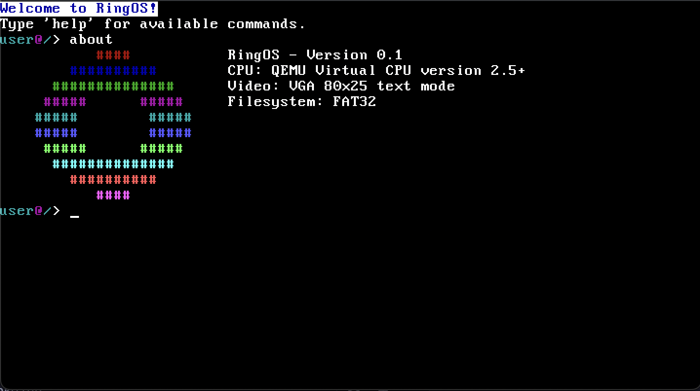

# RingOS

A hobby Operating System written in C.

## Features

 - [X] Fat32 filesystem
 - [X] Custom LibC (**Very** limited and by far not POSIX compliant, but soon)
 - [X] System interrupts
 - [X] Custom bootloader (No Grub Club)

## WIP
- [ ] Modern graphics
- [ ] Executable binary support
- [ ] Custom JVM
- [ ] Multiple users
- [ ] Multiple architectures

# Building and Running
## Linux and MacOS(x86)
```console
$ ./buildrun-linux.sh
```

## Silicone MacOS(M1>)
```console
$ ./buildrun-silicone.sh
```
